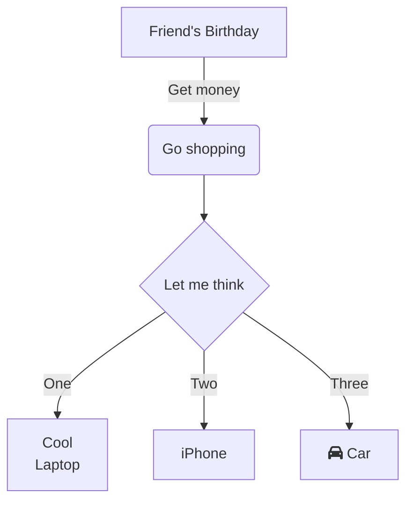
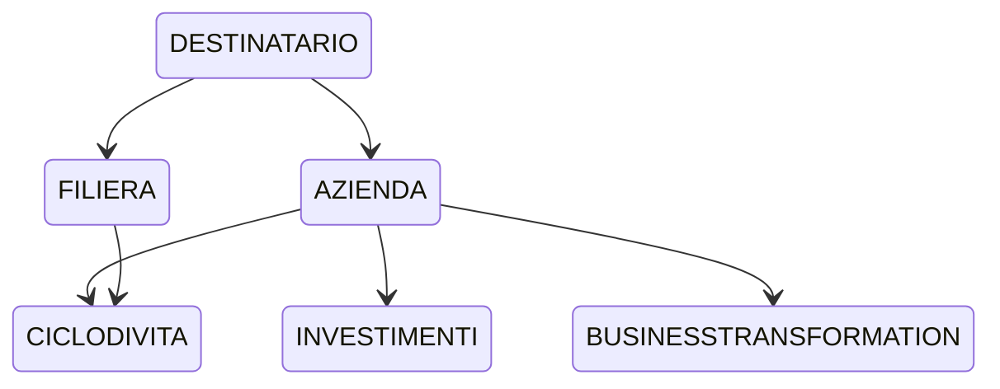
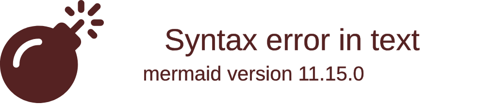
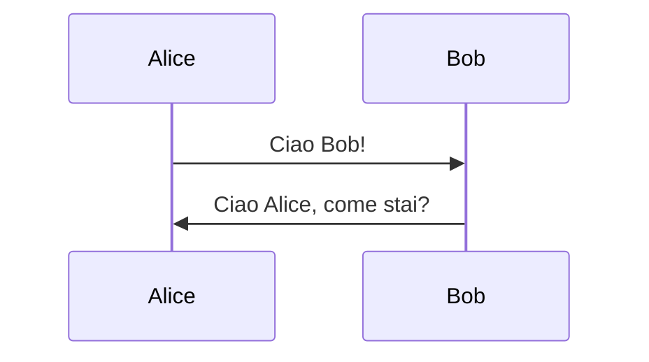

```mermaid
graph TD
    A[Friend's Birthday] -->|Get money| B(Go shopping)
    B --> C{Let me think}
    C -->|One| D["Cool <br> Laptop"]
    C -->|Two| E[iPhone]
    C -->|Three| F[fa:fa-car Car]
```

```mermaid
stateDiagram-v2

    DESTINATARIO-->AZIENDA
    DESTINATARIO-->FILIERA
    AZIENDA-->CICLODIVITA
    AZIENDA-->INVESTIMENTI
    AZIENDA-->BUSINESSTRANSFORMATION
    FILIERA-->CICLODIVITA
```

```mermaid 
pie
    title Key elements in Product X
    "Calcium" : 42.96
    "Potassium" : 50.05
    "Magnesium" : 10.01
    "Iron" :  5
 ```


```mermaid
graph LR
A([Inizio]) -- vai ... --> B((Qua))
A -.-> C[(bidone!)]
B === D[[e mo cosa fo?]]
C <--> D
```

```mermaid
sequenceDiagram
Alice ->> Bob: Ciao Bob!
Bob ->> Alice: Ciao Alice, come stai?
```
