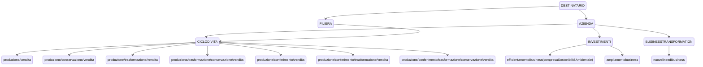
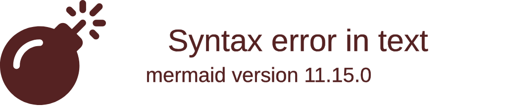
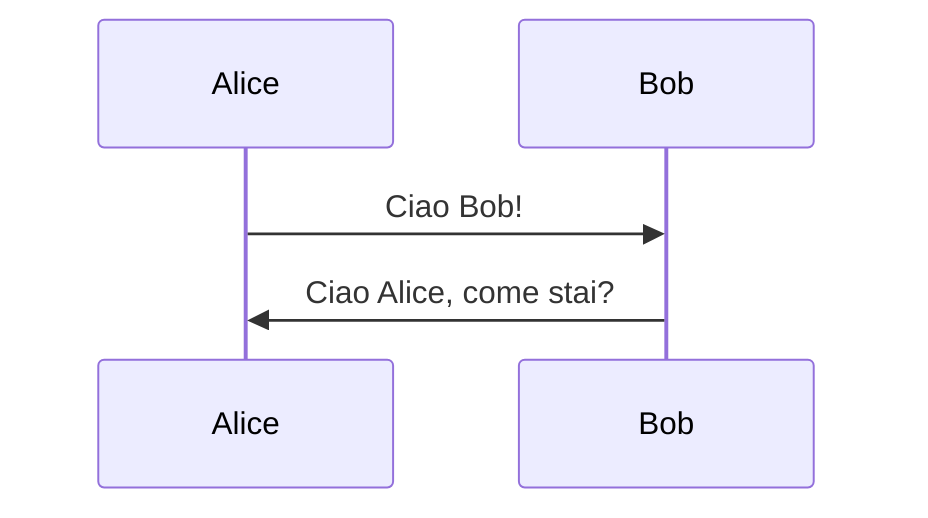

```mermaid
stateDiagram-v2

    DESTINATARIO-->AZIENDA
    DESTINATARIO-->FILIERA
    AZIENDA-->CICLODIVITA
    AZIENDA-->INVESTIMENTI
    AZIENDA-->BUSINESSTRANSFORMATION
    FILIERA-->CICLODIVITA
    CICLODIVITA-->produzione/vendita
    CICLODIVITA-->produzione/conservazione/vendita
    CICLODIVITA-->produzione/trasformazione/vendita
    CICLODIVITA-->produzione/trasformazione/conservazione/vendita
    CICLODIVITA-->produzione/conferimento/vendita
    CICLODIVITA-->produzione/conferimento/trasformazione/vendita
    CICLODIVITA-->produzione/conferimento/trasformazione/conservazione/vendita
    INVESTIMENTI-->efficientamentoBusiness(compresaSostenibilitàAmbientale)
    INVESTIMENTI-->ampliamentobusiness
    BUSINESSTRANSFORMATION-->nuovelineedibusiness

    
    
```

```mermaid 
pie
    title Key elements in Product X
    "Calcium" : 42.96
    "Potassium" : 50.05
    "Magnesium" : 10.01
    "Iron" :  5
 ```


```mermaid
graph LR
A([Inizio]) -- vai ... --> B((Qua))
A -.-> C[(bidone!)]
B === D[[e mo cosa fo?]]
C <--> D
```

```mermaid
sequenceDiagram
Alice ->> Bob: Ciao Bob!
Bob ->> Alice: Ciao Alice, come stai?
```
