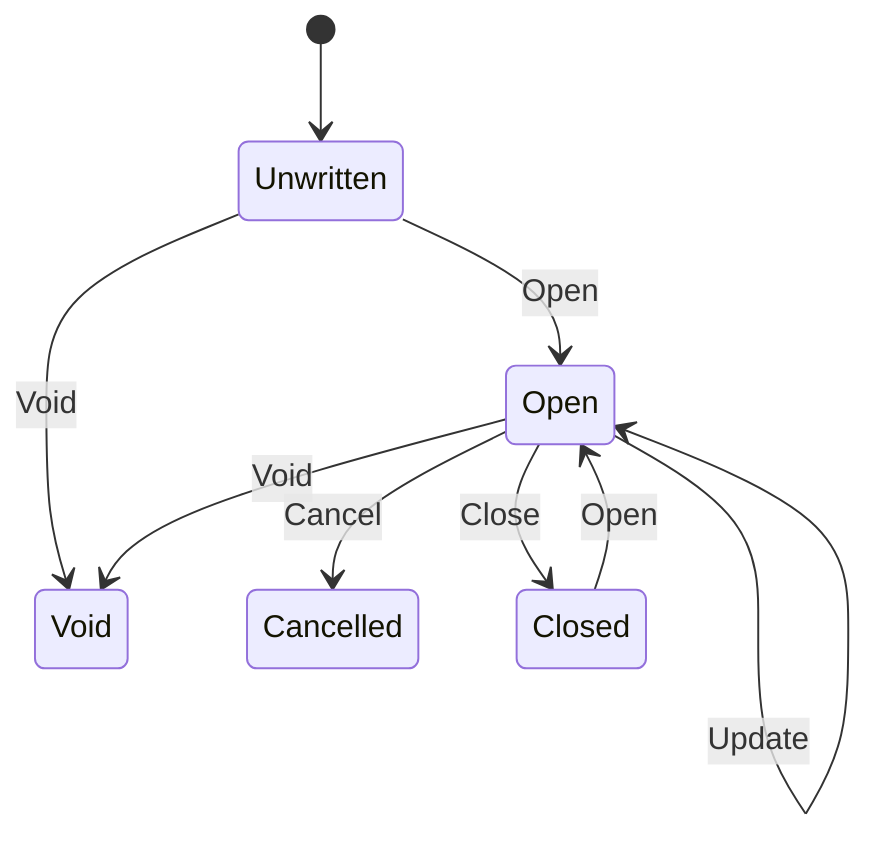

# Mermaid in Github




``mermaid
graph TD;
    A-->B;
    A-->C;
    B-->D;
    C-->D;
```


``mermaid
sequenceDiagram
    participant Alice
    participant Bob
    Alice->>John: Hello John, how are you?
    loop Healthcheck
        John->>John: Fight against hypochondria
    end
    Note right of John: Rational thoughts <br/>prevail!
    John-->>Alice: Great!
    John->>Bob: How about you?
    Bob-->>John: Jolly good!
```


``mermaid
gantt
dateFormat  YYYY-MM-DD
title Adding GANTT diagram to mermaid
excludes weekdays 2014-01-10section A section
Completed task            :done,    des1, 2014-01-06,2014-01-08
Active task               :active,  des2, 2014-01-09, 3d
Future task               :         des3, after des2, 5d
Future task2              :         des4, after des3, 5d
```


``mermaid
classDiagram
Class01 <|-- AveryLongClass : Cool
<<interface>> Class01
Class03 *-- Class04
Class05 o-- Class06
Class07 .. Class08
Class09 --> C2 : Where am i?
Class09 --* C3
Class09 --|> Class07
Class07 : equals()
Class07 : Object[] elementData
Class01 : size()
Class01 : int chimp
Class01 : int gorilla
Class08 <--> C2: Cool label
class Class10 {
  <<service>>
  int id
  size()
}
```
gitGraph:
options
{
    "nodeSpacing": 150,
    "nodeRadius": 10
}
end
commit
branch newbranch
checkout newbranch
commit
commit
checkout master
commit
commit
merge newbranch
```mermaid

```
